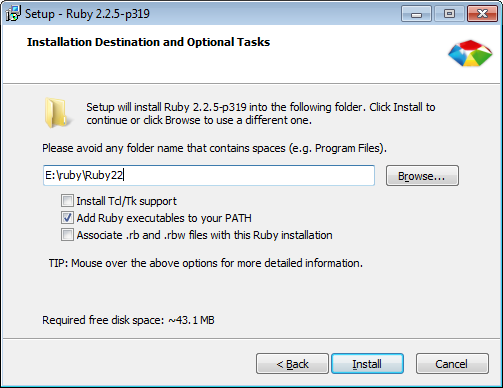

Ruby is the programming language that Jekyll is written in. You’ll need to install Ruby and the corresponding DevKit, which is needed to build some of Jekyll’s dependencies as “native extensions”.

## Install Ruby
As of writing the recommended version of Ruby is v2.2.5. Click on the button below and download the installer for that version that matches your system’s architecture (x86/x64).

<div class="pagination">
    <a class="pagination-item full" href="http://rubyinstaller.org/downloads/">Download Ruby for Windows</a>
    <span></span>
</div>

> Jekyll v3.x requires Ruby version >= 2.0.0.

Execute the installer and go through the steps of the installation. When you get to the screen below, make sure to check the “Add Ruby executables to your PATH” box.



Click Install and Ruby will be installed within seconds.

## Install the Ruby DevKit
Jekyll has some dependencies which, out of the box, only provide raw source code. To make them into fully functional executables, you’ll probably need to install the Development Kit.

Click the button below and download the DevKit archive that corresponds to your Ruby installation and system architecture. Choose the file marked as _For use with Ruby 2.0 and above_. 

Select either the 32bits or 64bits version depending on your system.

<div class="pagination">
    <a class="pagination-item full" href="http://rubyinstaller.org/downloads/">Download the Ruby Devkit</a>
    <span></span>
</div>

The download is a self-extracting archive. When you execute the file, it’ll ask you for a destination for the files. Enter a path that has no spaces in it. We recommend something simple, like `C:\RubyDevKit\`. Click Extract and wait until the process is finished.

Next, you need to initialize the DevKit and bind it to your Ruby installation. Open your favorite command line tool and navigate to the folder you extracted the DevKit into.

```
cd C:\RubyDevKit
```

Auto-detect Ruby installations and add them to a configuration file for the next step.

```
ruby dk.rb init
```

Now ensure the init command completed successfully.

```
ruby dk.rb review
```

[Did you get an error?](1x-ruby-and-devkit-error)


## Binding the DevKit to Ruby
Now complete your installation of the DevKit by binding it to your Ruby installation.

```
ruby dk.rb install
```


## Summary
That’s it! If all went well, you now have a working Ruby installation on your machine and you can build fully functional executables using the Ruby Development Kit. 

Ruby includes a way to install so-called gems—software packages that you can use from the command line and Jekyll is one of them! Click the button below to find out how you can successfully install it.

